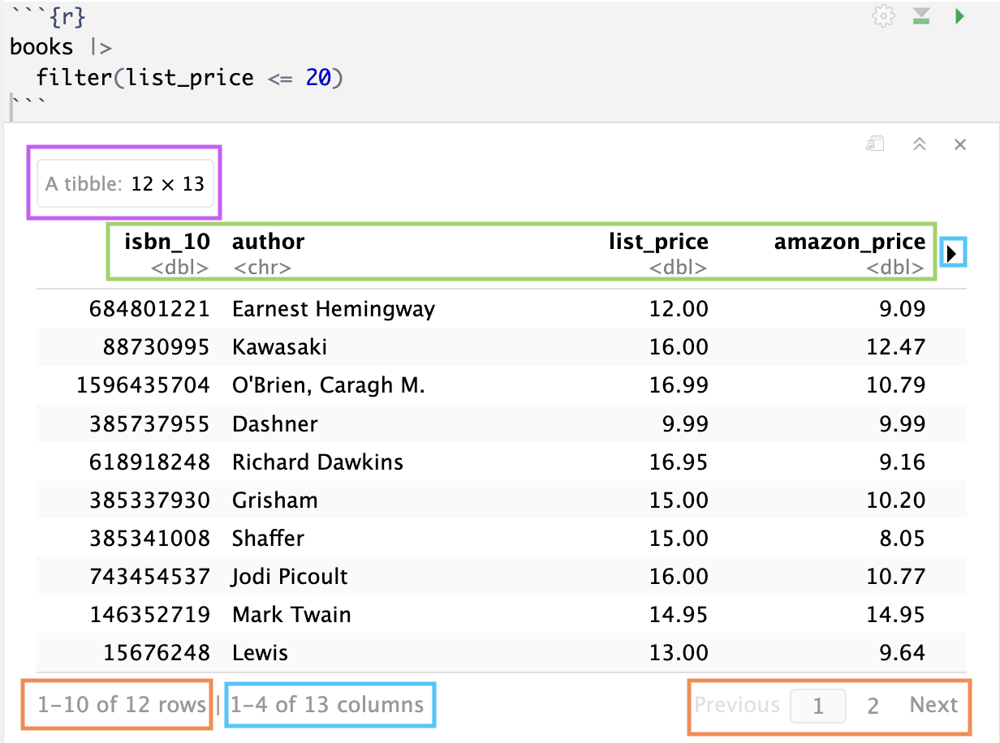
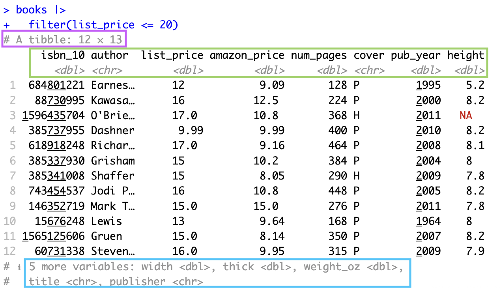

## Grammar of data wrangling

```{r echo = F, warning = F}
knitr::opts_chunk$set(echo = T)
library(tidyverse)
library(readr)
library(knitr)
plot_theme <- theme(text = element_text(size = 24))
insurance <- read_csv("data/insurance.csv")
```

-   Recall: data frames are objects in R that store tabular data in tidy form

-   The `dplyr` package (included in `tidyverse` package) uses the concept of functions as verbs that manipulate data frames.

    -   `filter()`: pick rows matching criteria
    -   `mutate()`: add new variables as columns
    -   `summarise()`: reduce variables to quantitative values
    -   `group_by()`: for grouped operations based on a variable
    -   `distinct()`: filter for unique rows
    -   `select()`: pick columns by name
    -   `slice()`: pick rows using indices
    -   and many more!!!

## Rules of dplyr functions

1.  The first argument is *always* a data frame
2.  Subsequent argument(s) say what to do with that data frame
    i.  We connect lines to code using a *pipe* operator (see next slide)
3.  *Always* return a data frame

## Pipes

-   In programming, a **pipe** is a technique for passing information from one process to another

-   In `dplyr`, the pipes are coded as `|>` (i.e. vertical bar and greater than sign)

    -   Not to be confused with `+` used to add layers in `ggplot`

-   We can think about pipes as following a sequence of actions which provide a more natural and easier to read structure

-   For example: suppose that in order to get to work, I need to find my car keys, start my car, drive to work, and then park my car

::::::: columns
:::: {.column width="50%"}
-   Expressed using pipes, this may look like:

::: fragment
```{r eval = F}
find("car_keys") |>
  start_car() |>
  drive(to = "work") |>
  park()
```
:::
::::

:::: {.column width="50%"}
-   Expressed as a set of nested `R` pseudocode, this may look like:

::: fragment
```{r eval = F}
park(drive(start_car(find("car_keys")), 
           to = "work"))
```
:::
::::
:::::::

## Logical operators in R

It is common to compare two quantities using logical operators. All of these operators will return a **logical** `TRUE` or `FALSE`. List of some common operators:

-   `<`: less than

-   `<=`: less than or equal to

-   `>`: greater than

-   `>=`: greater than or equal to

-   `==`: (exactly) equal to

-   `!=`: not equal to

::: fragment
```{r echo = T, eval = T}
1 < 4
```
:::

::: fragment
```{r echo = T, eval = T}
2 == 5
```
:::

::: fragment
```{r echo = T, eval = T}
2 != 5
```
:::

## Logical operators (cont.)

We might also want to know if a certain quantity "behaves" a certain way. The following also return logical outputs:

-   `is.na(x)`: test if `x` is `NA`

-   `x %in% y`: test if `x` is in `y`

-   `!x`: not `x`

::: fragment
```{r echo = T, eval = T}
is.na(NA)
```
:::

::: fragment
```{r echo = T, eval = T}
is.na("apple")
```
:::

::: fragment
```{r echo = T, eval = T}
3 %in% 1:10
```
:::

::: fragment
```{r echo = T, eval = T}

!TRUE
```
:::

## Working with data frames in RStudio

::::: columns
::: {.column width="50%"}
If executed code output in **Source**

{width="410"}
:::

::: {.column width="50%"}
If executed code output in **Console**


:::
:::::

-   ::: {style="color: purple"}
    Tibble (i.e. data frame) with 12 observations and 13 variables
    :::

-   ::: {style="color: green"}
    For variables shown, their names and types
    :::

    -   ::: {style="color: skyblue"}
        Variables not displayed. In Source, you can click to see other variables.
        :::

-   ::: {style="color: orange"}
    Source will display at most 10 observations, but you can click to see more.
    :::

## Live code

Data from Amazon: we have data about several books available for purchase from Amazon. I took a random sample from the original sample of 325 cases from the [original dataset](https://dasl.datadescription.com/datafile/amazon-books).

Copy and paste the following line of code into a new code chunk in your live code! We will load in the data together and take a quick look at it before diving into data wrangling

```{r eval = F, echo = T}
url_file <- "https://raw.githubusercontent.com/midd-stat201a-fall25/midd-stat201a-fall25.github.io/refs/heads/main/data/amazon_books.csv"
```
