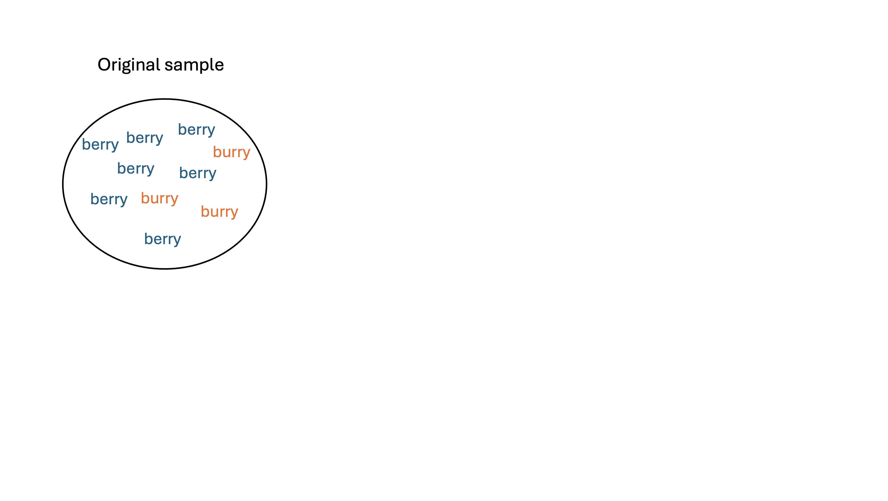
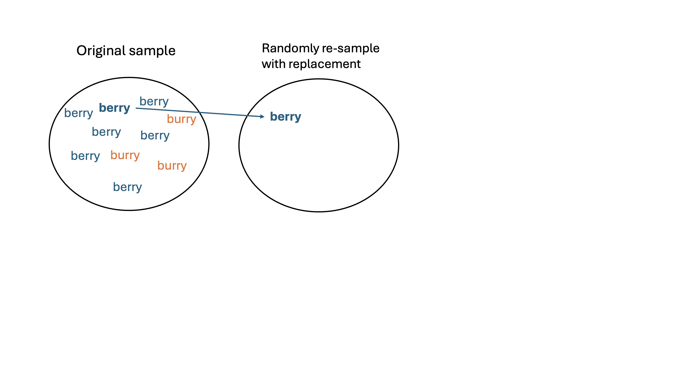
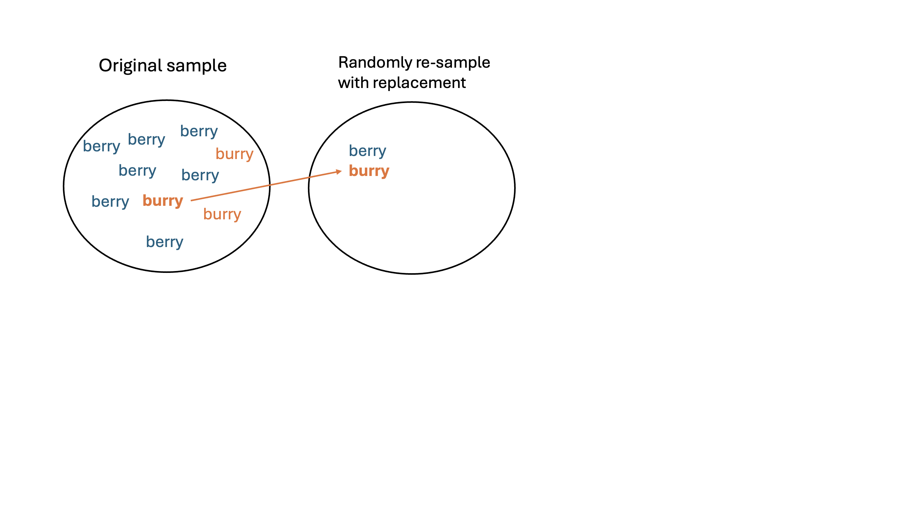
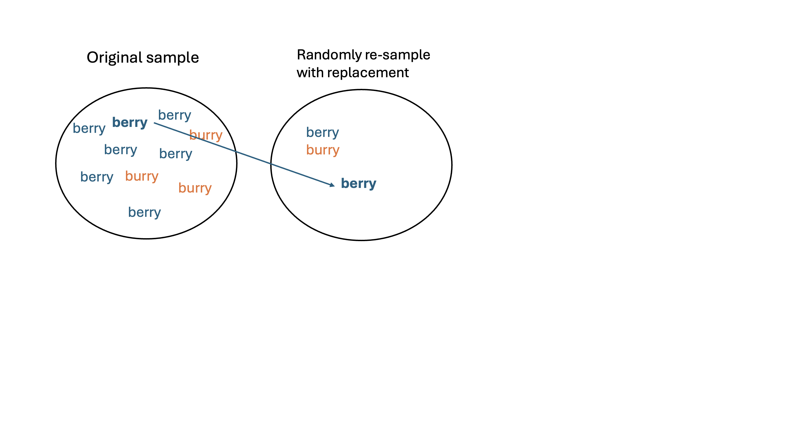
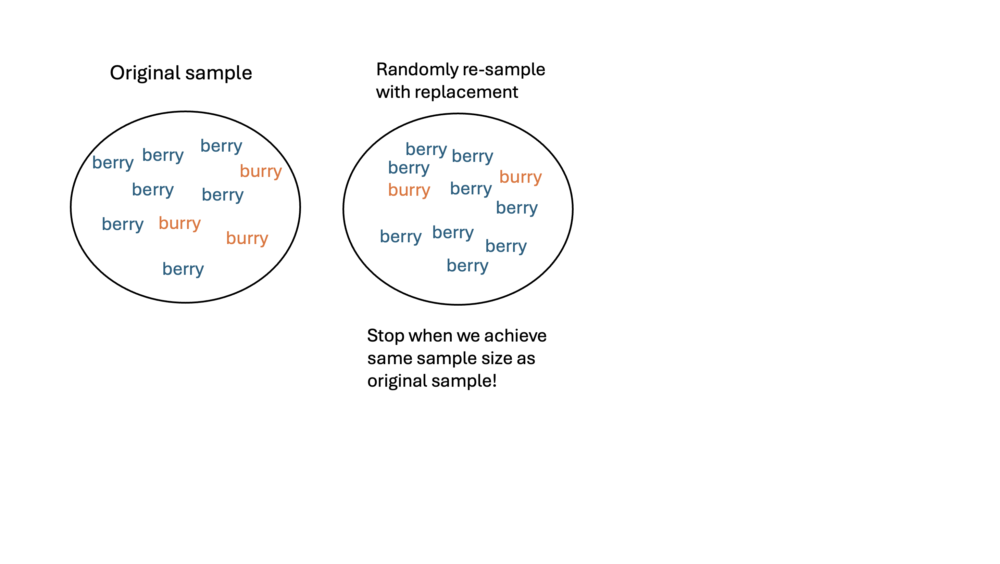
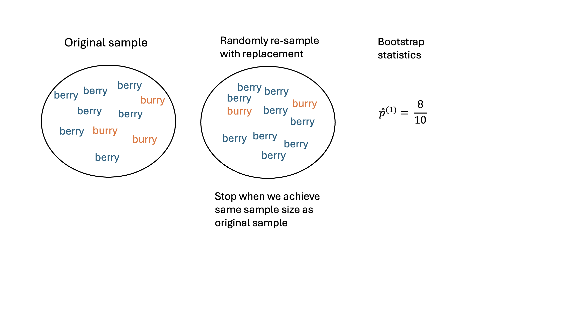
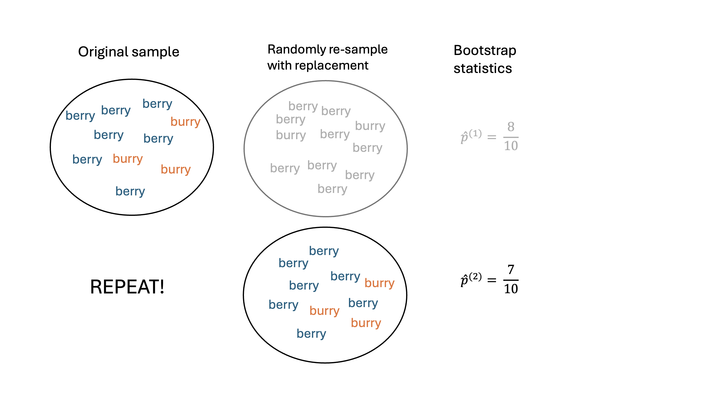
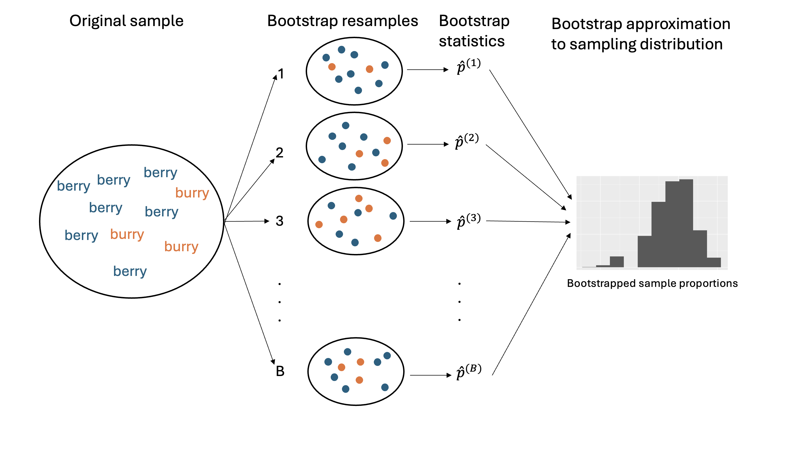

# Housekeeping

```{r echo = F}
knitr::opts_chunk$set(echo = F, warning = F, messabundance = F)
library(tidyverse)
library(readr)
plot_theme <- theme(text = element_text(size = 16))
set.seed(1)
admissions <- read_csv("data/ucb_admissions.csv") |>
  sample_frac()
```

## Recap

-   Statistical inference: using data from sample to say something about target population

    -   Estimation and testing

-   Research questions usually about population parameter, for which we obtain a **point estimate** as a "best guess" of that parameter

-   However, the values of the point estimates will vary across samples –\> **sampling distribution**: the distribution of sample statistics across repeated sampling

    -   **Standard error**: the variability of the sample distribution

## Practice

As part of a quality control process for computer chips, an engineer at a factory randomly samples 212 chips during a week of production to test the current rate of chips with severe defects. She finds that 27 of the chips are defective.

::: discuss
1.  What is the target population?
2.  What parameter is being estimated?
3.  What is the point estimate for parameter?
4.  Discussion: The historical rate of defects is 10%. Should the engineer be surprised by the observed rate of defects during the current week? Why or why not?
:::

## Practice

A nonprofit wants to understand the fraction of households that have elevated levels of lead in their drinking water. They expect at least 5% of homes will have elevated levels of lead, but not more than about 30%. They randomly sample 800 homes and work with the owners to retrieve water samples, and they compute the fraction of these homes with elevated lead levels. They repeat this 1,000 times and build a distribution of sample proportions.

::: discuss
1.  What is this distribution called?
2.  What is the variability of this distribution called?
3.  Suppose the researchers’ budget is reduced, and they are only able to collect 250 observations per sample, but they can still collect 1,000 samples total. They build a new distribution of sample proportions. How do you think the variability of this new distribution compares to the variability of the original distribution in 1? Why?
:::

## How to answer the research question?

Remember, our questions of interest are about a population. The following options list ways to answer the question. For each, what are the pros/cons?

::: discuss
-   Using the population

-   Using a single sample (i.e. the sample distribution)

-   Using several samples (i.e. the sampling distribution)
:::

-   Thus, for answering estimation questions, we should aim to access a sampling distribution (we did this with the candy activity!)

## How to obtain a sampling distribution?

-   Sometimes, we ***assume*** that the population/data have a very specific behavior, and this allows us to *exactly* define the sampling distribution without having to physically sample

    -   Will see this in a couple of weeks

-   If we don't want to make assumptions, then we rely on sampling

    -   Can we obtain multiple samples cheaply and quickly?
    -   We will use **simulation-based** techniques!

# Bootstrap

Bootstrapping is a flexible, *simulation-based* method that allows us to move forward in an analysis without knowing exactly how the data were generated.

## Procedure

1.  Assume we have a single sample $\boldsymbol{x} = (x_{1}, x_{2}, \ldots, x_{n})$ from the population. Note the sample size is $n$
2.  Choose a large number $B$. For $b$ in $1,2, \ldots, B$:
    i.  Re-sample: take a sample of size $n$ with *replacement* from $\boldsymbol{x}$. Call this set of $b$-th re-sampled data $\boldsymbol{x}^*_{b}$
    ii. Calculate: calculate and record the statistic of interest from $\boldsymbol{x}^{*}_{b}$

:::: fragment
::: {style="color: maroon"}
At the end of this procedure, we will have a **bootstrap distribution** of resampled or bootstrap statistics.

-   This bootstrap distribution **approximates** the sampling distribution!
:::
::::

:::: fragment
::: discuss
In the candy activity, I claim that we did not perform bootstrapping. Why not?
:::
::::

## Example

Let's return to the Middle-"berry" vs Middle-"burry" example. Suppose my population of interest is STAT 201A students.

-   I'll work with a random sample of $n = 10$ values as my sample (even though I conducted a census):

::: fragment
$$x = \{\color{blue}{\text{berry}}, \color{orange}{\text{burry}}, \color{blue}{\text{berry}}, \color{blue}{\text{berry}}, \color{blue}{\text{berry}}, \color{orange}{\text{burry}}, \color{blue}{\text{berry}}, \color{orange}{\text{burry}}, \color{blue}{\text{berry}}, \color{blue}{\text{berry}}\}$$
:::

-   $p$: the true population proportion who say "berry" (in theory unknown to us)

-   $\widehat{p_{obs}} = \frac{7}{10}$: the (observed) sample proportion from my sample

-   Let's obtain a bootstrap distribution of the sampling proportions!

## Visualize



## Visualize (cont.)



## Visualize (cont.)



## Visualize (cont.)



## Visualize (cont.)



## Visualize (cont.)



## Visualize (cont.)



## Visualize (cont.)



## Live code demonstration

## Why resample with replacement?

-   We want to understand the sampling error of the sampling distribution!

-   ::: discuss
    What would the bootstrap samples $\boldsymbol{x}^*_b$ look like if we sampled *without* replacement?
    :::

    -   Sampling without replacement -\> zero variation in the resampled statistics

-   Resampling with replacement will give us "new" datasets that are similar to original sample distribution but not exactly the same!

    -   Ideally, the variation in the bootstrapped statistics is similar to the true standard error of the sample statistics

## Remarks

-   ::: {style="color: maroon"}
    How good the bootstrap distribution is relies on having a representative original sample!
    :::

    -   Resampling from initial sample should be roughly equivalent to sampling directly from the population

-   Requires computational tools!

    -   We need $B$ to be large enough to accurately capture variability. $B=5000$ or $B=10000$ sufficient in this class

    -   More complex problems will require larger $B$

-   Bootstrapping can fail!

-   Bootstrapping is *not* a solution to small sample sizes!!
