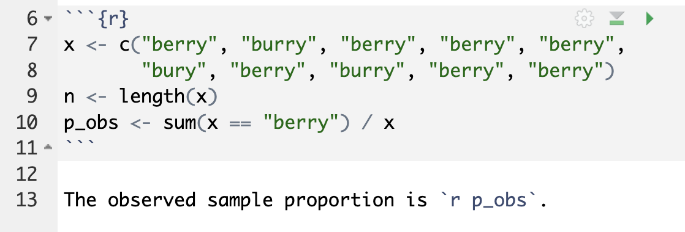
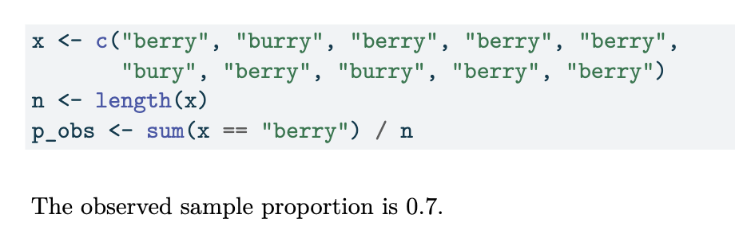

## Housekeeping

-   Coding practice due tonight
-   Midterms returned tomorrow!

```{r echo = F, message= F}
knitr::opts_chunk$set(echo = F, warning = F, messabundance = F)
library(tidyverse)
library(readr)
plot_theme <- theme(text = element_text(size = 24))

get_bootstrap <- function(x, n, B, stat){
  bootstrap_stats <- rep(NA, B)
  for(b in 1:B){
    # resample
    x_boot <- sample(x = x, size = n, replace = TRUE)
    # calculate and store bootstrap statistic
    if(stat %in% c("mean", "prop")){
      bootstrap_stats[b] <- mean(x_boot)
    }
  }
  bootstrap_stats
}
```

## Bootstrap recap

-   Sampling distribution describes how statistic behaves under repeated sampling from population

-   Typically cannot repeatedly sample from population, so we obtain **bootstrap distribution** as *approximation* of the sampling distribution of the statistic!

    1.  Assume we have a sample $x_{1}, x_{2}, \ldots, x_{n}$ from the population. Call this sample $\boldsymbol{x}$. Note the sample size is $n$
    2.  Choose a large number $B$. For $b$ in $1,2, \ldots, B$:
        i.  Resample: take a sample of size $n$ with *replacement* from $\boldsymbol{x}$. Call this set of resampled data $\boldsymbol{x}^*_{b}$
        ii. Calculate: calculate and record the statistic of interest from $\boldsymbol{x}^{*}_{b}$

::: fragment
At the end of this procedure, we will have a distribution of **resample or bootstrap statistics**
:::

## Bootstrap distribution from activity

```{r}
B <- 5000
```

In our original sample of $n = 10$, we had $\widehat{p_{obs}} = 0.7$.

```{r echo = F, fig.height = 8}
set.seed(1)
x <- c(rep(1,7), rep(0, 3))
n <- length(x)
boot_props <- rep(NA, B)
for(b in 1:B){
  x_b <- sample(x, size = n, replace = TRUE)
  boot_props[b] <- mean(x_b)
}

boot_df <- data.frame(props = boot_props) 
```

::::: columns
::: {.column width="50%"}
We have the following bootstrap distribution of sample proportions, obtained from $B=$ `r B` iterations:

```{r fig.height=8}
boot_df |>
  ggplot(aes(x = props)) +
  geom_histogram(bins = 10, col = "white") +
  labs(x="Sample proportions", title = "Bootstrap dist. of sample proportion")+
    theme(text = element_text(size = 30)) +
    scale_x_continuous(breaks = seq(0,1,0.2))
```
:::

::: {.column width="50%"}
We can compare to the true sampling distribution (because it's easy for me to re-sample from the population here):

```{r fig.height = 8}
class_dat <- read_csv("../data/stat201_data.csv")
pop <- rep(0, nrow(class_dat))
pop[class_dat$pronounciation == "berry"] <- 1
p_true <- mean(pop)
p_resamp <- rep(NA, B)
for(b in 1:B){
  p_resamp[b] <- mean(sample(pop, n, replace = T))
}
sampling_df <- data.frame(props = p_resamp)
ggplot(sampling_df, aes(x = props)) +
  geom_histogram(bins = 10, col = "white") +
  labs(title = "True sampling dist. of sample proportions",
       x = "Sample proportion")+
  scale_x_continuous(breaks = seq(0,1,0.2)) +
    theme(text = element_text(size = 30)) 
```
:::
:::::

-   Notice that our bootstrap distribution isn't a great approximation (maybe $n = 10$ did not yield a representative sample)

## Answering estimation question

-   Great...but what do we do with the bootstrap distribution?

-   Recall our research question: What proportion of STAT 201A pronounced as Middle-"berry"?

    -   Could respond using our single point estimate: $\hat{p_{obs}} = `r mean(x)`$

    -   But due to variability, we recognize that the point estimate will rarely (if ever) equal population parameter

-   Rather than report a single number, why not report a range of values?

    -   ::: {style="color: maroon"}
        This is **only** possible if we have a sampling distribution to work with!!
        :::

## Confidence intervals

-   Analogy: would you rather go fishing with a single pole or a large net?

    -   A range of values gives us a better chance at capturing the true value

-   A **confidence interval** provides such a range of plausible values for the parameter (more rigorous definition coming soon)

    -   "Interval": specify a lower bound and an upper bound

    -   Confidence intervals are not unique! Depending on the method you use, you might get different intervals

## Bootstrap percentile interval

-   The $\gamma \times 100$% **bootstrap percentile interval** is obtained by finding the bounds of the middle $\gamma \times 100$% of the bootstrap distribution

-   Called "percentile interval" because the bounds are the $(1-\gamma)/2\times100$ and $(1+\gamma)/2\times 100$ percentiles of the bootstrap distribution

::: discuss
-   If $\gamma = 0.90$, then the bounds would be at which percentiles?
:::

-   For our purposes, "bootstrap confidence interval" will be equivalent to "bootstrap percentile interval"
-   `quantile()` function in `R` gives us easy way to obtain percentiles: `quantile(x, p)` gives us $p$-th percentile of `x`

## Visualizing bootstrap confidence interval

```{r}
# data frame containing our bootstrap statistics
gamma <- 0.9

bounds <- quantile(boot_props, c((1-gamma)/2, (1+gamma)/2))
boot_df |>
  ggplot(aes(x = props)) +
  geom_histogram(binwidth = 0.1, col = "white")+
  geom_vline(xintercept = bounds[1], col = "orange", linetype = "dashed",
             size = 2)+
  geom_vline(xintercept = bounds[2], col = "orange", linetype = "dashed",
             size = 2)+
  scale_x_continuous(breaks = seq(0,1,0.2)) +
  labs(caption = paste0("orange lines denote ",gamma*100, "% bootstrap CI"), x = "sample proportion",
       title = "Bootstrap dist. of sampling proportions")+
  theme(text = element_text(size = 24))

```

-   Our `r gamma*100`% bootstrap CI for $p$: (`r bounds[1]`, `r bounds[2]`)

## Interpreting a confidence interval

-   Our `r gamma*100`% bootstrap CI for $p$: (`r bounds[1]`, `r bounds[2]`). Does this mean there is a `r gamma*100`% chance/probability that the true proportion lies in the interval?

    -   ::: {style="color: maroon"}
        Answer: NO
        :::

-   Remember: bootstrap distribution is based on our original sample

    -   If we started with a different original sample $\boldsymbol{x}$, then our estimated `r gamma*100`% confidence interval would also be different

-   ::: {style="color: maroon"}
    What a confidence interval (CI) represents: if we take many independent repeated samples from this population using the same method and calculate a $\gamma \times 100$ % CI for the parameter in the exact same way, then in theory, $\gamma \times 100$ % of these intervals should capture/contain the parameter
    :::

    -   $\gamma$ represents the long-run proportion of CIs that theoretically contain the true parameter

    -   However, in real life we never know if any particular interval(s) actually do!

## Interpreting a confidence interval (cont.)

-   Correct interpretation (generic) of our interval $(a,b)$: We are $\gamma \times 100$ % confident that the population parameter is between $a$ and $b$.

    -   ::: discuss
        Interpret our bootstrap CI in context
        :::

-   Again: why is this interpretation **incorrect**? "There is a `r gamma*100`% chance/probability that the true parameter value lies in the interval."

    -   True proportion from census is $p = `r round(p_true,3)`$

## Remarks

-   ::: discuss
    What is a virtue of a "good" confidence interval?
    :::

-   ::: discuss
    How do you expect the interval to change as the original sample size $n$ changes?

    How do you expect the interval to change as level of confidence $\gamma$ changes?
    :::

-   Once again, a good interval relies on a representative original sample!

## Comparing confidence intervals

Comparing changes in `r gamma*100`% bootstrap CI for sample sizes $n = 5, 10, \text{ and } 20$.

```{r}
set.seed(4)
n2 <- 20
n1 <- 5
n_orig <- length(x)
x1 <- sample(pop, n1)
x2 <- sample(pop, n2)
rm(n)
sampling_dfll <- rbind(mutate(boot_df, n = n_orig),
                data.frame(props = get_bootstrap(x2, n2, B, "prop"), 
                           n = n2),
                data.frame(props = get_bootstrap(x1, n1, B, "prop"), n = n1)) |>
  mutate(n_lab = paste0("n = ", n)) |>
    mutate(n_lab = factor(n_lab, levels = paste0("n = ", sort(c(n2,n1,n_orig)))))


bounds <- sampling_dfll |>
  group_by(n_lab) |>
  summarise(lb = quantile(props, (1-gamma)/2), ub = quantile(props, (1+gamma)/2))  |>
  ungroup() |>
  data.frame()


```

:::::: columns
::: {.column width="70%"}
```{r fig.height=6}
sampling_dfll |>
  ggplot(aes(x = props)) +
  geom_histogram(binwidth = 0.1, col = "white")+
  facet_wrap( ~ n_lab) +
  geom_vline(data = bounds, mapping = aes(xintercept = lb), col = "orange", size = 2, linetype = "dashed")+
  geom_vline(data = bounds, mapping = aes(xintercept = ub), col = "orange",
             size = 2, linetype = "dashed")+
  scale_x_continuous(breaks = seq(0,1,0.2)) +
  theme(text = element_text(size = 25)) +
    labs(caption = paste0("orange lines denote ",gamma*100, "% bootstrap CI"), x = "proportion")
```
:::

:::: {.column width="30%"}
```{r}
bounds |>
  rename("n" = n_lab)|>
  mutate(interval = paste0("(", round(lb, 2), ", ", round(ub, 2), ")")) |>
  select(n, interval) |>
  kableExtra::kable()
```

::: discuss
What do you notice about the bootstrap distributions and CIs as $n$ increases?
:::
::::
::::::

## Live code + Coding practice!

-   Live code:

    -   in-line code

    -   setting a seed

-   You will investigate what happens as we move $\gamma$ between $0$ to $1$!

## In-line code

In-line code allows us to be reproducible! Suppose I do all this analysis:

```{r echo = T}
x <- c("berry", "burry", "berry", "berry", "berry", "bury", "berry", "burry", "berry", "berry")
n <- length(x)
p_obs <- sum(x == "berry") / n
p_obs
```

I might want to report this value! Rather than "hard-code" the value `r p_obs` in the white text of my `.qmd`, I want the `.qmd` to update the value dynamically upon rendering!

::::::: columns
:::: {.column width="50%"}
::: fragment
`.qmd` file 
:::
::::

:::: {.column width="50%"}
::: fragment
Rendered PDF 
:::
::::
:::::::

-   Notice the syntax of inline code! Backticks, r, and the spacing matter!

## Setting a seed

When we do random sampling, how can we reproduce our results? By setting a seed!

-   "Random" sampling is achieved via a "random number generating function", which takes in a number as input. Kind of like initializing the randomness.

<!-- -->

-   `set.seed(<integer>)` before doing random sampling will initialize the generator at that specific `integer` input, so subsequent calls to random number generating functions will produce the exact same sequence of "random" numbers
